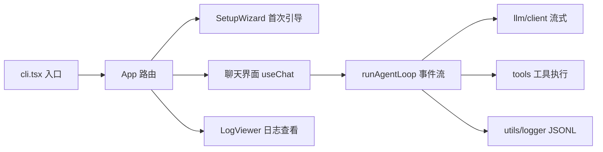

# cyjcode-cli 总计划（ROADMAP）

## 1. 项目定位与目标

`cyjcode-cli` 是一个个人 coding agent CLI（命令名 `cyjcode`），定位是**开发体验优先**的终端 AI 编程助手：零构建开发、全链路 JSONL 日志、内置实时日志查看器，不引入权限审批等安全机制。

三条设计原则：

1. **开发体验优先**：`tsx` 直跑 TypeScript，改完代码立刻能跑；关键链路全部打日志，跑了立刻能看到内部发生了什么。
2. **架构清晰可读懂**：每个模块职责单一，从入口到 agent 循环的调用链一目了然，任何时候都能快速回到代码里改任何一层。
3. **渐进式补短板**：先跑通最小闭环，再按阶段补会话持久化、上下文压缩、更多工具与终端体验，不追求一步到位。

## 2. 技术栈

基于已确定的 `package.json`（Node >= 22，ESM，`"type": "module"`）：

| 依赖 | 职责 | 选型理由 |
| --- | --- | --- |
| `tsx` | 开发期直接运行 TS | 零构建反馈，`npm run dev` 即改即跑 |
| `ink` + `react` | 终端 UI | 用 React 组件模型写终端界面，生态成熟 |
| `openai` | LLM 流式调用 | OpenAI 兼容协议，可接任意兼容端点 |
| `zod` | 工具参数 schema | 声明式定义工具入参，运行时校验 + 可转 JSON Schema 提供给 LLM |
| `yargs` | 命令行参数/子命令 | 管理 `logs` 等子命令与启动参数 |
| `chalk` | 终端着色 | 日志与消息高亮 |
| `esbuild` | 构建打包 | 单文件 ESM 产物 + shebang，一步出 `dist/cli.js` |

开发命令：

- `npm run dev` — tsx 直跑 `src/cli.tsx`
- `npm run typecheck` — `tsc --noEmit` 类型检查
- `npm run build` — typecheck + esbuild 打包出 `dist/cli.js`

## 3. 总体架构

架构思路借鉴 file-agent-cli，代码从零手写。

### 3.1 模块划分

```
src/
├── cli.tsx          # 入口：yargs 解析子命令，logs → LogViewer，否则 → App
├── agent/           # agent 主循环（runAgentLoop 异步生成器事件流）
├── llm/             # OpenAI 兼容流式 client（text delta + tool_calls 累积）
├── tools/           # 一文件一工具 + 统一 Tool 接口（zod 定义参数）
├── ui/              # Ink 界面：App 路由、聊天区、输入框、SetupWizard、LogViewer
├── config/          # 配置读写（~/.cyjcode/config.json）
└── utils/           # JSONL logger 等
```

### 3.2 核心数据流



- 用户输入经 `useChat` 进入 `runAgentLoop`（AsyncGenerator）。
- 循环内调用 LLM 流式接口，产出 text delta 事件实时上屏。
- 若 LLM 返回 tool_calls，执行对应工具、把结果追加回消息历史，继续下一轮；无 tool_calls 时循环结束。
- 全程关键节点写 JSONL 日志（按天分割）。
- `logs` 子命令启动 LogViewer，轮询 tail 当日日志文件实时展示（用轮询而非 fs.watch，避开 Windows 兼容问题）。

### 3.3 与 file-agent-cli 的三处差异

1. **zod 校验工具参数**：工具参数用 zod schema 声明，兼顾运行时校验与 JSON Schema 生成。
2. **yargs 管理子命令**：替代手写 `process.argv` 判断。
3. **esbuild 构建**：替代 tsup，typecheck 与打包串在同一条 `build` 命令里。

## 4. 分阶段路线图

### P1 — 基础版 MVP

**目标**：跑通"配置 → 对话 → 工具调用 → 日志"最小闭环。

**交付物**：

- config store：读写 `~/.cyjcode/config.json`（baseUrl / apiKey / model）
- SetupWizard：首次启动无配置时进入引导
- llm/client：OpenAI 兼容流式调用，text delta + tool_calls 累积
- agent/loop：`runAgentLoop` 异步生成器事件流，支持多轮工具调用
- 5 个文件工具：listDir / search / read / write / rename
- Ink 聊天 UI：消息列表 + 输入框 + 流式输出
- 斜杠命令框架：内置 `/help`、`/config`
- utils/logger + `logs` 子命令 LogViewer：JSONL 日志（session.start / llm.request / llm.response / tool.start / tool.end / error），实时彩色查看

**验收标准**：

- `npm run dev` 启动，完成引导后可正常多轮对话
- 能通过对话让 agent 读/写/搜索当前目录下的文件
- 另开终端通过 `logs` 子命令（`tsx src/cli.tsx logs`）实时看到彩色日志流

### P2 — 会话持久化 + 上下文压缩

**目标**：关终端不丢历史，长对话不爆 token。

**交付物**：

- 会话持久化：消息历史落盘到 `~/.cyjcode/sessions/`
- `/resume` 命令：列出并恢复历史会话
- 上下文压缩：token 估算，超阈值时调 LLM 对早期历史做摘要压缩，保留最近消息原文

**验收标准**：

- 重启 CLI 后 `/resume` 可恢复上次会话并继续对话
- 构造超长对话触发压缩后，对话可继续且不丢关键上下文

### P3 — 更多工具：bash / git / web

**目标**：从"文件助手"升级为"编程助手"。

**交付物**：

- bash 工具：执行 shell 命令并回传 stdout / stderr / exit code
- git 工具：status / diff / log / commit 等常用子操作
- web 工具：抓取网页并提取正文
- agent 循环最大轮数（MAX_ROUNDS）从硬编码改为配置项

**验收标准**：

- agent 能完成"看 git 状态 → 读改动文件 → 跑命令验证"的复合任务
- 工具轮数上限可通过配置调整

### P4 — 终端体验：流式中断 + Markdown 渲染

**目标**：补齐交互体验。

**交付物**：

- Esc 流式中断：AbortController 取消进行中的 LLM 流与工具执行
- Markdown 渲染：助手消息按 Markdown 渲染，代码块语法高亮（候选方案：ink-markdown 或自研解析）

**验收标准**：

- LLM 输出过程中按 Esc 可立即中断，界面状态正确回滚
- 代码块、标题、列表等 Markdown 元素在终端正确高亮展示

## 5. 非目标（暂不做）

- 权限审批机制（工具执行前确认）
- 日志脱敏、错误日志截断等安全机制
- MCP（Model Context Protocol）接入
- VSCode 插件 / IDE companion
- 自动化测试体系
- plan mode / 多 agent 协作

## 6. 版本里程碑

| 版本 | 对应阶段 | 里程碑 |
| --- | --- | --- |
| v0.1 | P1 | 基础版 MVP 跑通 |
| v0.2 | P2 | 会话持久化 + 上下文压缩 |
| v0.3 | P3 | bash / git / web 工具 |
| v0.4 | P4 | 流式中断 + Markdown 渲染 |
